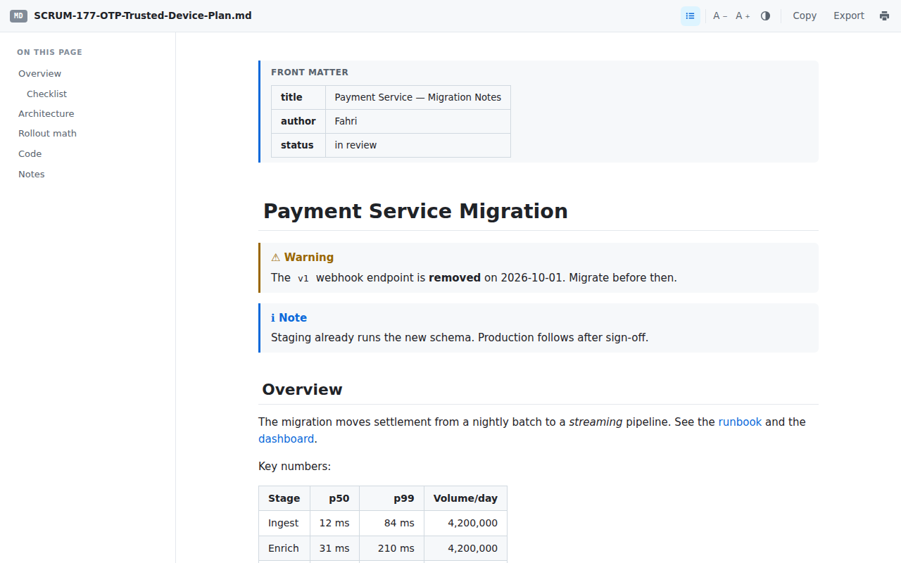

# Markdown Preview for Jira

A Chrome extension (Manifest V3) that renders `.md` attachments **inside** a Jira issue,
instead of making you download the file and open it somewhere else.

Open an issue that has a markdown attachment, click the pill in the bottom-right corner,
and the file opens rendered on top of the issue.



## Why an ordinary markdown viewer doesn't work here

Every markdown viewer extension works the same way: you *navigate to* a `.md` file and it
renders the page. That never fires on a Jira attachment, because:

- Jira serves attachments as a download (`Content-Disposition: attachment`) — the browser
  saves the file, no page is rendered, and no content script ever runs.
- The URL is id-based (`/rest/api/3/attachment/content/12345`) and redirects to a signed
  media host, so there is no `.md` extension to match on.
- The modern issue view renders attachments as media cards, so the filename never appears
  in an `<a href>` at all.

This extension goes the other way round: it reads the attachment list from the issue's own
REST API, fetches the file from the service worker (the only context that can follow that
redirect while carrying your session), and renders the result in an overlay.

## Rendering

- GitHub-flavored markdown — tables, task lists, strikethrough, autolinks
- Syntax highlighting for ~40 languages (highlight.js)
- **Mermaid** diagrams, redrawn when you switch theme
- **KaTeX** math — `$inline$`, `$$display$$`, `\(…\)`, `\[…\]`
- GitHub alerts — `> [!NOTE]`, `[!TIP]`, `[!IMPORTANT]`, `[!WARNING]`, `[!CAUTION]`
- YAML front matter as a collapsible table rather than a stray `---` rule
- Table of contents with scroll-spy, light/dark themes, adjustable text size
- Copy raw markdown, copy any code block, export standalone HTML, print, pop out to a tab
- Everything is sanitized with DOMPurify before it reaches the DOM

## Install (unpacked)

1. Unzip somewhere permanent — Chrome loads it from disk on every start.
2. `chrome://extensions` → turn on **Developer mode**.
3. **Load unpacked** → pick the folder containing `manifest.json`.

## Use

| | |
|---|---|
| Issue with one `.md` attachment | The pill shows the filename. Click it. |
| Issue with several | The pill shows a count. Click, then pick the file. |
| `Alt + Shift + M` | Same thing, from the keyboard. |
| Toolbar icon | Lists the markdown attachments on the current issue. |
| `Esc` | Close the preview. `Ctrl/Cmd + \` toggles the table of contents. |

## Permissions

| Permission | Reason |
|---|---|
| `storage` | Theme / text size / TOC preference, and a few-second hand-off when you pop a preview into its own tab. |
| `*://*.atlassian.net/*`, `*://*.atlassian.com/*`, `*://*.jira.com/*` | Read the issue's attachment list, and download the `.md` file you click. Nothing runs on any other site. |
| `*://*/*` — **optional, off by default** | Only for Jira instances that store attachment downloads on a non-Atlassian host. Enable it in settings if a preview fails with *"Chrome blocked the download"*; revoke it in the same place. |

Nothing is collected and nothing leaves your browser. Every library is vendored in
`vendor/` — no remote code, no analytics. See `store/PRIVACY.md`.

## Layout

```
manifest.json
viewer.html            the renderer page (iframe over the issue, or its own tab)
src/
  background.js        service worker: the privileged fetch, and the pop-out hand-off
  content.js           attachment discovery, the pill, the modal shell (shadow DOM)
  content.css          the little that is injected into the Jira page
  viewer.js            markdown-it pipeline, TOC, mermaid, katex, export
  viewer.css           the reading theme
options/
  popup.html/js        toolbar popup
  options.html/js      settings, including the optional-permission toggle
  ui.css               shared chrome for both
vendor/
  mdp-bundle.js        markdown-it + plugins + highlight.js + DOMPurify (bundled)
  mermaid.min.js       loaded lazily, only when a document has a diagram
  katex.min.js/.css    loaded lazily, only when a document has math
  fonts/               KaTeX woff2
build/bundle-entry.js  source for vendor/mdp-bundle.js
screenshots/           1280x800 captures, also used by the Web Store listing
testfixtures/sample.md exercises every feature — handy while developing
PRIVACY.md             the privacy policy linked from the Web Store listing
LICENSE                MIT
```

## Rebuilding the bundle

```bash
npm install
npm run build      # esbuild build/bundle-entry.js -> vendor/mdp-bundle.js
```

Add a language by adding it to the `langs` map in `build/bundle-entry.js` and rebuilding.

## Deliberately left out (for now)

These worked in an earlier build and were removed to keep the extension to one clear
purpose, which is what the Web Store asks for. Each is a small amount of code to bring
back if it turns out to be wanted:

- Right-click a link → *Preview as Markdown*, on any site
- An inline **Preview** chip beside `.md` links (Confluence attachments, comments)
- Rendering `.md` pages that a server returns as `text/plain`
- A paste-a-URL box in the toolbar popup

## Known limits

- Images inside a markdown attachment that point at other attachments by relative path
  won't resolve — Jira's attachment URLs aren't path-relative to each other.
- Exported HTML links the KaTeX stylesheet from a CDN; everything else in the export is
  self-contained.
- Jira Data Center exposes `/rest/api/2/...`; discovery targets Cloud's `/rest/api/3/...`.

## License

MIT — see [LICENSE](LICENSE).

---

Not affiliated with, endorsed by, or sponsored by Atlassian. Jira is a trademark of
Atlassian Pty Ltd.
