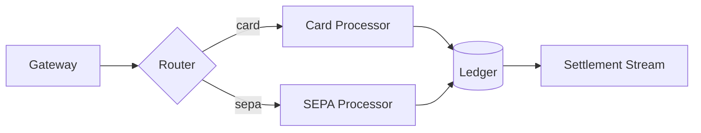

# Payment Service Migration

> [!WARNING]
> The `v1` webhook endpoint is **removed** on 2026-10-01. Migrate before then.

> [!NOTE]
> Staging already runs the new schema. Production follows after sign-off.

## Overview

The migration moves settlement from a nightly batch to a *streaming* pipeline.
See the [runbook](./runbook.md) and the [dashboard](https://example.com/dash).

Key numbers:

| Stage | p50 | p99 | Volume/day |
|-------|----:|----:|-----------:|
| Ingest | 12 ms | 84 ms | 4,200,000 |
| Enrich | 31 ms | 210 ms | 4,200,000 |
| Settle | 96 ms | 1,340 ms | 118,000 |

### Checklist

- [x] Schema migration written
- [x] Backfill job dry-run
- [ ] Cut over the webhook consumer
- [ ] Delete `legacy_settlement` table
  - [ ] Take a final snapshot first

## Architecture



## Rollout math

Error budget burn rate is $r = \frac{e}{b \cdot t}$, and we alert when:

$$
\sum_{i=1}^{n} w_i \cdot r_i > 1.5 \quad \text{over a 6h window}
$$

## Code

```typescript
export async function settle(batch: Payment[]): Promise<Receipt[]> {
  const results = await Promise.allSettled(
    batch.map((p) => ledger.post({ id: p.id, amount: p.amountMinor }))
  );
  return results.flatMap((r, i) =>
    r.status === "fulfilled" ? [r.value] : (log.warn({ id: batch[i].id }), [])
  );
}
```

```bash
# verify the backfill
psql "$DATABASE_URL" -c "select count(*) from settlement where migrated_at is null;"
```

```python
def burn_rate(errors: int, budget: float, hours: float) -> float:
    """Return the fraction of the error budget consumed per hour."""
    return errors / (budget * hours)
```

## Notes

Inline `code`, ~~struck text~~, **bold**, *italic*, and a keyboard hint: press <kbd>Ctrl</kbd>+<kbd>K</kbd>.

1. First
2. Second
3. Third

---

<details>
<summary>Raw config</summary>

```yaml
settlement:
  mode: streaming
  batch_size: 500
  retries: 3
```

</details>
